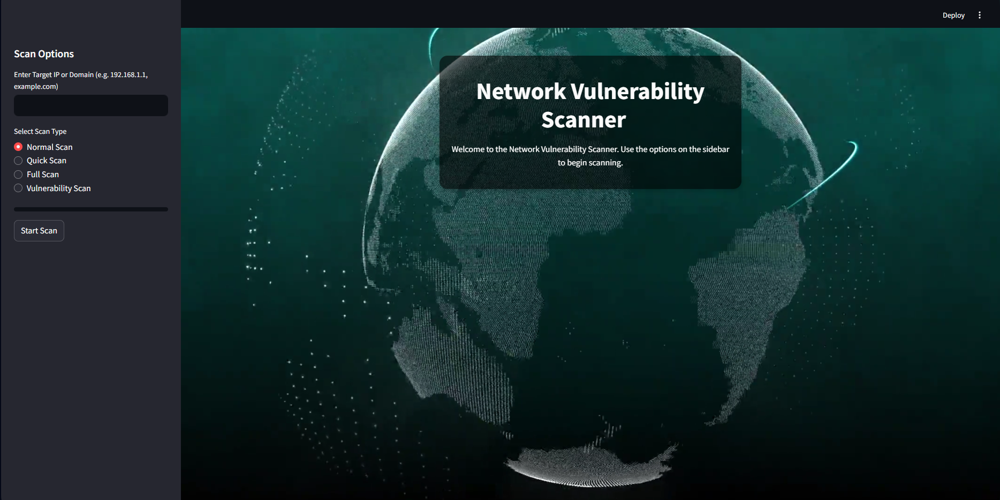

# 🛡️ NetShield

**NetShield** is a powerful and user-friendly web-based tool designed to assess the security posture of a given network host. Built using Streamlit for the frontend and Nmap for the backend scanning engine, this application enables users to perform detailed port and vulnerability scans with just a few clicks.

## 🚀 Features

- 🌐 Scan by IP address or domain
- 🧪 Supports:
  - Normal Scan (Ports 1–1024)
  - Quick Scan (Common ports)
  - Full Scan (Top 1000 ports)
  - Vulnerability Scan (NSE-based for known exploits)
- 📊 Interactive UI with live progress
- 🎥 Background video for UI enhancement
- ⬇️ Downloadable scan results

## 📸 Output Image

> UI Screenshot of NetShield running on Streamlit



## 🛠️ Tech Stack

- [Streamlit](https://streamlit.io/)
- [Python Nmap](https://pypi.org/project/python-nmap/)
- Python 3.8+

## 🧰 Installation

```bash
git clone https://github.com/jpravin664/NetShield.git
cd NetShield
pip install -r requirements.txt


## ⚙️ Usage

```bash
streamlit run app.py
```

Then open the app in your browser at `http://localhost:8501`.

## 📂 Project Structure

```
.
├── app.py                # Streamlit UI
├── scanner.py            # Port and vulnerability scanning logic
├── requirements.txt      # Required packages
```


## ⚠️ Disclaimer

This tool is for **educational and authorized testing only**. Do not scan targets without permission.

